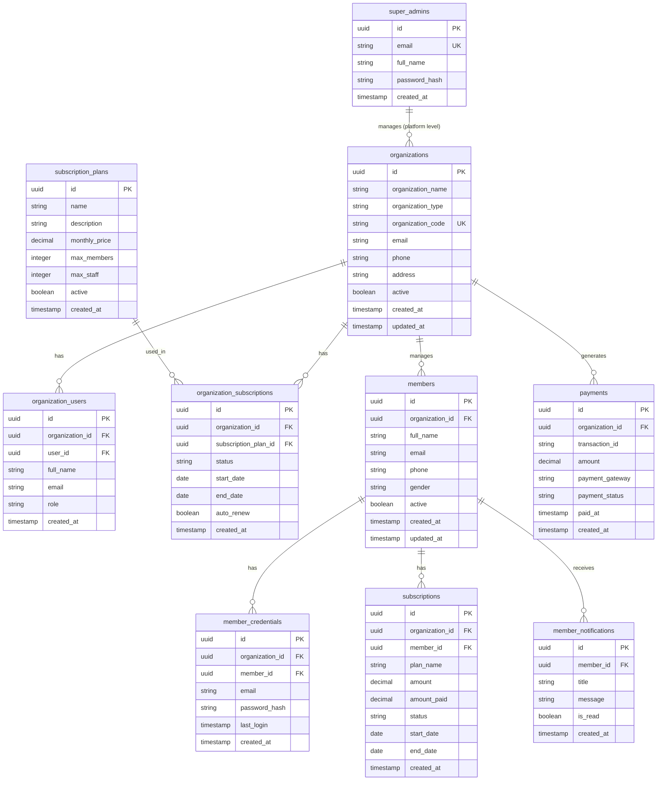

# Database Schema — Beqwik

**Database:** PostgreSQL via Supabase  
**Last Updated:** June 2026

> **Note:** This schema is inferred from frontend service queries, type definitions, and edge function code. Column types marked as (inferred) should be verified against the actual Supabase schema. Missing tables or columns may exist that are not accessed by the current frontend.

---

## Entity Relationship Diagram



---

## Table Documentation

### `organizations`

The central table. Every business registered on Beqwik is an organization.

| Column | Type | Nullable | Notes |
|---|---|---|---|
| `id` | uuid | No | Primary key, auto-generated |
| `organization_name` | text | No | Display name of the business |
| `organization_type` | text | No | e.g., "Gym", "Hostel", "Academy" |
| `organization_code` | text | No | Unique code, auto-generated from name initials (e.g., "GYM001") |
| `email` | text | Yes | Business contact email |
| `phone` | text | Yes | Business contact phone |
| `address` | text | Yes | Business address |
| `active` | boolean | Yes | Whether org is active on platform |
| `created_at` | timestamp | Yes | Auto-set by Supabase |
| `updated_at` | timestamp | Yes | Updated on edits |

**Indexes:** `organization_code` should be unique-indexed  
**RLS:** Org users should only read/update their own row  
**Used by:** Organizations page, Admin Dashboard, onboarding, analytics

---

### `organization_users`

Maps Supabase Auth users to organizations. One user can belong to one organization (current constraint enforced in code).

| Column | Type | Nullable | Notes |
|---|---|---|---|
| `id` | uuid | No | Primary key |
| `organization_id` | uuid | No | FK → organizations.id |
| `user_id` | uuid | No | FK → auth.users.id (Supabase Auth) |
| `full_name` | text | Yes | From user metadata at time of registration |
| `email` | text | Yes | Also queried to find org by user email |
| `role` | text | Yes | "owner", "staff" (not enforced in UI yet) |
| `created_at` | timestamp | Yes | Auto-set |

**Warning:** Currently queried by `email` AND by `user_id` — should be consistent. Email-based lookup is fragile if email changes.

---

### `subscription_plans`

Beqwik's own pricing tiers. These are the plans that org owners purchase.

| Column | Type | Nullable | Notes |
|---|---|---|---|
| `id` | uuid | No | Primary key |
| `name` | text | No | e.g., "Starter", "Professional", "Enterprise" |
| `description` | text | Yes | Plan description |
| `monthly_price` | decimal | No | In Indian Rupees |
| `max_members` | integer | Yes | Null = unlimited |
| `max_staff` | integer | Yes | Null = unlimited |
| `active` | boolean | No | Only active plans shown in SelectPlan |
| `created_at` | timestamp | Yes | |

**Note:** The landing page shows ₹999 Starter, ₹2499 Professional, Custom Enterprise — these are UI-only values and may differ from what's in the DB.

---

### `organization_subscriptions`

**Platform-level subscriptions (B2B).** Records which SaaS plan each organization is on.

| Column | Type | Nullable | Notes |
|---|---|---|---|
| `id` | uuid | No | Primary key |
| `organization_id` | uuid | No | FK → organizations.id |
| `subscription_plan_id` | uuid | No | FK → subscription_plans.id |
| `status` | text | No | "active", "expired", "cancelled" |
| `start_date` | date/timestamp | No | When plan started |
| `end_date` | date/timestamp | No | When plan expires |
| `auto_renew` | boolean | Yes | Whether to auto-renew |
| `created_at` | timestamp | Yes | |

**Important:** Do NOT confuse with `subscriptions` table (see below).

---

### `payments`

Transaction history for payments made on the platform.

| Column | Type | Nullable | Notes |
|---|---|---|---|
| `id` | uuid | No | Primary key |
| `organization_id` | uuid | Yes (inferred) | FK → organizations.id |
| `transaction_id` | text | Yes | Gateway transaction reference |
| `amount` | decimal | No | Payment amount in INR |
| `payment_gateway` | text | Yes | e.g., "razorpay", "stripe", "manual" |
| `payment_status` | text | No | "success", "failed", "pending" |
| `paid_at` | timestamp | Yes | When payment was processed |
| `created_at` | timestamp | Yes | |

**Current issue:** Super Admin Payments page does not join this table with organizations or subscription_plans, so only transaction-level info is shown.

---

### `members`

Member profiles. These are end-users of organizations, NOT Supabase Auth users.

| Column | Type | Nullable | Notes |
|---|---|---|---|
| `id` | uuid | No | Primary key |
| `organization_id` | uuid | Yes (inferred) | FK → organizations.id |
| `full_name` | text | No | |
| `email` | text | Yes | Login email (also stored in member_credentials) |
| `phone` | text | Yes | |
| `gender` | text | Yes | |
| `active` | boolean | Yes | Whether member is active |
| `created_at` | timestamp | Yes | |
| `updated_at` | timestamp | Yes | |

---

### `member_credentials`

Hashed passwords for member authentication. Separate from `members` to isolate sensitive data.

| Column | Type | Nullable | Notes |
|---|---|---|---|
| `id` | uuid | No | Primary key |
| `organization_id` | uuid | No | FK → organizations.id |
| `member_id` | uuid | No | FK → members.id |
| `email` | text | No | Login email (scoped per org) |
| `password_hash` | text | No | bcrypt hash (generated server-side in edge function) |
| `last_login` | timestamp | Yes | Updated on each successful login |
| `created_at` | timestamp | Yes | |

**RLS:** This table must only be accessible via the service role key (edge functions). No anon reads.

---

### `subscriptions`

**Member-level subscriptions (B2C).** Records which service plan each member has within their organization.

| Column | Type | Nullable | Notes |
|---|---|---|---|
| `id` | uuid | No | Primary key |
| `organization_id` | uuid | No | FK → organizations.id |
| `member_id` | uuid | No | FK → members.id |
| `plan_name` | text | Yes | Free-text plan name set by admin |
| `amount` | decimal | Yes | Amount charged |
| `amount_paid` | decimal | Yes | Duplicate column in schema — same value written to both |
| `status` | text | No | "active", "expired", "cancelled" |
| `start_date` | date/timestamp | No | |
| `end_date` | date/timestamp | No | |
| `created_at` | timestamp | Yes | |

**Important:** Do NOT confuse with `organization_subscriptions` (platform B2B billing).

**Note:** `amount` and `amount_paid` are redundant — this should be cleaned up.

---

### `member_notifications`

Notifications broadcasted by org admins to their members.

| Column | Type | Nullable | Notes |
|---|---|---|---|
| `id` | uuid | No | Primary key |
| `member_id` | uuid | No | FK → members.id |
| `title` | text | No | Notification title |
| `message` | text | No | Notification body |
| `is_read` | boolean | No | Default false |
| `created_at` | timestamp | Yes | |

---

### `super_admins`

Platform administrator accounts for Beqwik internal team.

| Column | Type | Nullable | Notes |
|---|---|---|---|
| `id` | uuid | No | Primary key |
| `email` | text | No | Unique login email |
| `full_name` | text | Yes | Displayed in sidebar |
| `password_hash` | text | No | bcrypt hash |
| `created_at` | timestamp | Yes | |

**Critical Security Issue:** This table is currently queried from the client with the anon key. The password hashes are potentially exposed. This table should have RLS set to deny all anon access, and login should be handled via an edge function.

---

## Key Relationships Summary

```
organizations (1) ─── (n) organization_users      [Org has many admin users]
organizations (1) ─── (n) organization_subscriptions [Org has many SaaS plans over time]
organizations (1) ─── (n) members                  [Org has many members]
organizations (1) ─── (n) payments                 [Org generates many payments]
subscription_plans (1) ── (n) organization_subscriptions [Plan used by many orgs]
members (1) ─── (1) member_credentials             [Member has one credential set per org]
members (1) ─── (n) subscriptions                  [Member has many service plans over time]
members (1) ─── (n) member_notifications           [Member receives many notifications]
```

---

## Planned Future Tables

| Table | Purpose | Priority |
|---|---|---|
| `gym_slots` | Training slot schedules (replace localStorage) | High |
| `gym_slot_bookings` | Member bookings for slots | High |
| `gym_equipment` | Equipment inventory (replace localStorage) | High |
| `hostel_menu_items` | Hostel/mess menu | Medium |
| `hostel_meals` | Daily meal log | Medium |
| `academy_classes` | Academy class schedules | Medium |
| `audit_logs` | Track all admin actions | Medium |
| `staff` | Organization staff members | Medium |
| `branches` | Multi-branch support | Low |
| `payment_plans` | Per-organization custom plans | Low |
